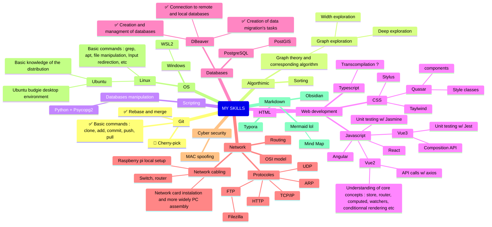

 <p align="center">  𝓜𝓪𝓻𝓴𝓭𝓸𝔀𝓷 𝓔𝓷𝓳𝓸𝔂𝓮𝓻 </p>
 
 ***
   
 
 
 🎓 Studying at **Polytech** (**Lyon 1 University**) in 4<sup>th</sup> year of **engineering degree** in **Computer Science**  
 
 👔 Doing my **apprenticeship** at [*Adequation*](https://adequation.fr/) 


 💽 Come discover my **latest personnal** project [*Smooth Pomodoro*](https://github.com/NicolasGuruphat/smooth-pomodoro)

 🌱 Currently **learning** different topics like :
  - 💎 Ruby On Rails
  - 🦺 Cybersecurity
  - 👀 Vue.JS
  - 🍍 Pinia
  - 🟦 TypeScript
  - 🧪 Jest
   <!-- 
   - 🌬 TailWind
   - ⚛️ React
   - 🔴 Laravel
   - 🐘 PostgreSQL + 🦫 DBeaver
   - 🦊 GitLab CI/CD -->
     
📚 You can find my **portfolio** [*here*](https://nicolasguruphat.github.io/online-cv/) (I'm still working on it)  

📫 And you can **reach me** by clicking [*here*](mailto:nicolas.guruphat@gmail.com)  
 <!--
  
📃 You can also find my **Mardown CV** [*here*](https://github.com/NicolasGuruphat/CV)  


  -->

 ***
<a href="https://www.codewars.com/users/Nicolas%20Guruphat"></a>
<a href="https://stackoverflow.com/users/19390218/nicolas"></a>

<a href="https://www.root-me.org/NicolasGuruphat"></a>
<!--
<p align="center"></p>

<p align="center"></a></p>
 
 <p align="center"><</p>
 

 -->
  <!--
***

```
### <p align="center">  Skills Map </p>

Legend :
- ✅ Well-developped skill
- 🚧 Still developping the skill


```
  -->
<!-- 
To put in the graph : 
- Raspberry pi
- Web server 
-->

